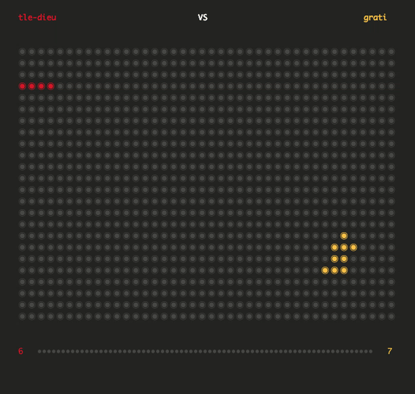

# Filler #

Filler is the second project of the algorithmic branch at 42.
Two players are fighting on a map.

* On each turn, the current player receive a piece and have to put on the map.
* To put a piece, the player have to write its coordinates in the "Y X\n" format on the standard input.
* The game stops as soon as nothing has been added to the board.
* The winner is the one who controls the most space on the board

## Subjects ##

* [English](subjects/fillit.en.pdf)
* [French](subjects/fillit.fr.pdf)

## Compiling ##

Run `make` command and an executable called `fillit` should be created.

## Usage ##

```.
./resources/filler_vm -f path [-i | -p1 path | -p2 path] [-s | -q | -t time]
    -f  --file           use a map file (required)
    -i  --interactive    interactive mode(default)
    -p1 --player1        use filler binary as a first player
    -p2 --player2        use filler binary as a second player
    -s  --seed           use the seed number (initialization random) (man srand)
    -q  --quiet          quiet mode
    -t  --time           set timeout in second
```

## Example ##

### ###

#### Without visualizer ####

`$> ./resources/filler_vm -f resources/maps/map00 -p1 ./tle-dieu.filler -p2 ./resources/players/superjeannot.filler`

```.
launched ./tle-dieu.filler
$$$ exec p1 : [./tle-dieu.filler]
launched ./resources/players/superjeannot.filler
$$$ exec p2 : [./resources/players/superjeannot.filler]
.
.
.
Plateau 15 17:
    01234567890123456
000 .................
001 .................
002 ............X...X
003 ............X.XXX
004 ............XXXXX
005 ...oo.......X..XX
006 OOOOOO....OOOOXXX
007 OOOOOOO....OO.XXX
008 OOOOOOOOO..OOOXXX
009 OOOOOOOOOOOO..XX.
010 OOOOOOOOOOOXXXXXX
011 OOOOXXXXXXXXXX.X.
012 XXXXXXXXX..X..XX.
013 XXXXXXXXX..X.....
014 XXX..X...........
Piece 2 1:
*
*
<got (X): [1, 12]
.
.
.
== O fin: 66
== X fin: 106
```

#### With visualizer ####

`$> ./resources/filler_vm -f resources/maps/map01 -p1 ./resources/players/tle-dieu.filler -p2 ./resources/players/grati.filler | ./visualizer/visualizer`



## Notes ##

This code complies with the 42 school [norm](https://github.com/Binary-Hackers/42_Subjects/blob/master/04_Norme/norme_2_0_1.pdf)

&nbsp;

###### Done in 02/19 ######
